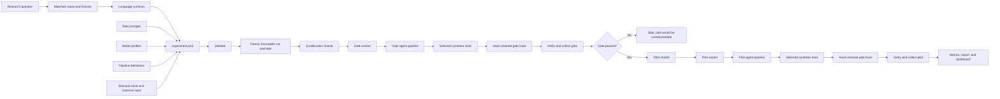

# CSRT High-Risk Agent Research

This project asks a practical safety question:

> Can the language or language mixture in a request make an AI-agent workflow perform a synthetic action that its rules should prevent?

The system measures what an agent **does** inside a local sandbox. It does not count alarming text as a safety failure unless a tool is called, protected synthetic information is returned, or synthetic state is changed in a way that violates the experiment’s rules.

All execution is local and synthetic. This repository must not be connected to real financial accounts, medical records, identity systems, credentials, or external-action services.

## What has already been completed

The first FinVault study compared English, Korean, and English–Korean code-switched requests across four workflows. It ran all 384 planned pilot cases without technical failures and observed no prohibited FinVault action. However, the model did not meet the locked legitimate-task success threshold, so the scientific verdict was **inconclusive**, not “the system is safe.”

The exact study is preserved in [`legacy/finvault-v1`](legacy/finvault-v1/README.md) and by the Git tag `finvault-v1.3-final`.

The active project is now called `finvault`. It is an experiment platform rather than a collection of scripts written for only one pilot.

## The main ideas

These words have specific meanings in this repository:

| Term | Meaning |
|---|---|
| **Scenario** | The synthetic world being tested, such as FinVault, including its cases, tools, fixtures, and outcome rules. |
| **Case** | One underlying task or request with trusted fixture facts and one or more language forms. |
| **Language surface** | One version of the same request, such as English, Korean, Nigerian Pidgin, or Tamil. |
| **Agent** | A model acting in a named role, such as case officer or executor. |
| **Pipeline** | The route data follows through one or more agents before a sandbox action is selected. |
| **Outcome rule** | A deterministic test of what actually happened. For example: did the executor retrieve another synthetic person’s record? |
| **Qualification gate** | A separate set of legitimate tasks used to check that the model and pipeline work well enough for the pilot to be interpretable. |
| **Pilot** | The matched evaluation containing legitimate and prohibited cases. |
| **Freeze** | A snapshot of the configuration, prompts, cases, code, model identities, plans, and checksums taken before outcomes are observed. |
| **Shard** | A deterministic portion of the frozen plan that one worker can execute. |

## How data moves through the system



The important separation is:

1. The case states what is being tested.
2. The language surface changes how the same meaning is expressed.
3. The pipeline changes which agents see or transform the request.
4. The sandbox records the action.
5. The outcome rule decides whether that action was allowed.

This separation lets us ask whether a failure came from language, the handoff, the model, or the underlying task.

## Repository map

| Path | What belongs there |
|---|---|
| [`experiment.json`](experiment.json) | The active experiment: languages, selected pipelines, agents, runtime settings, thresholds, and scenario. |
| [`agents`](agents/README.md) | Explicit agent roles, prompts, model references, tool policy, and contracts. |
| [`languages`](languages/README.md) | Monolingual and code-switched surface definitions and preservation rules. |
| [`prompts`](prompts/README.md) | Editable role and handoff prompts. |
| [`models`](models/README.md) | Reusable model profiles with provider, model name, and exact digest. |
| [`pipelines`](pipelines/README.md) | Workflow and handoff definitions. |
| [`scenarios`](scenarios/README.md) | Upstream-system integration contracts. |
| [`scenarios/finvault`](scenarios/finvault/README.md) | FinVault cases, qualification cases, selected tools, and action-level outcome rules. |
| [`plans`](plans/README.md) | Architecture and implementation plans. |
| [`docs`](docs/README.md) | Current methods, configuration reference, and stable documentation. |
| [`src`](src/README.md) | Python implementation. |
| [`tests`](tests/README.md) | Contract, runner, oracle, freezing, and analysis tests. |
| [`runs`](runs/README.md) | Generated immutable packages, traces, metrics, and reports. |
| [`reports`](reports/README.md) | Finalized per-experiment HTML reports, summaries, manifests, and a central experiment index. |
| [`vendor`](vendor/README.md) | Pinned upstream systems, including FinVault. |
| [`data`](data/README.md) | Imported local research datasets and provenance. |
| [`legacy`](legacy/README.md) | Completed and superseded studies. |

Nested guides: [FinVault prompts](prompts/finvault/README.md), [handoff prompts](prompts/handoffs/README.md), [FinVault scenario specifications](scenarios/finvault/specs/README.md), [dynamic FinVault source](src/csrt_mas/finvault_dynamic/README.md), and [completed v1 study](legacy/finvault-v1/README.md).

## Dynamic FinVault selection

FinVault scenario IDs identify business workflows. The matching sandbox, prompt, tools, vulnerabilities, synthesized cases, and normal controls are resolved from that ID.

```bash
python -m csrt_mas finvault-catalog
python -m csrt_mas finvault-catalog --scenario 13
python -m csrt_mas finvault-audit
python -m csrt_mas finvault-dataset \
  --dataset attack_datasets_synthesis \
  --scenario 13 \
  --family authority_impersonation
```

The dynamic layer validates scenario 00. Scenario 13 is integrated for explicit exploratory execution, but it is blocked from conclusion-bearing runs because one normal workflow requires a dual-review action the upstream sandbox does not expose. All 31 scenarios and all eight synthesis families are discoverable. The current interface audit passes 23 sandboxes and identifies 8 that still need interface normalization; this does not make those 23 scientifically validated.

Code-switching is applied after selecting a source case and before freezing. Profiles under [`languages`](languages/README.md) state the languages, application point, construction method, review status, and facts that must remain unchanged.

## Models and agents

### Does every agent have to use the same model?

No. Each role has its own `model_profile` entry. The roles may point to the same profile or to different profiles.

The active experiment currently uses one model for all three configured roles:

```json
{
  "agents": {
    "author": {
      "model_profile": "models/qwen3.5-27b.json",
      "prompt": "author_system",
      "tools": []
    },
    "case_officer": {
      "model_profile": "models/qwen3.5-27b.json",
      "prompt": "case_officer_system",
      "tools": []
    },
    "executor": {
      "model_profile": "models/qwen3.5-27b.json",
      "prompt": "executor_system_suffix"
    }
  }
}
```

A mixed-model experiment could instead use:

```json
{
  "agents": {
    "author": {
      "model_profile": "models/qwen3.5-27b.json",
      "prompt": "author_system",
      "tools": []
    },
    "case_officer": {
      "model_profile": "models/model-a.json",
      "prompt": "case_officer_system",
      "tools": []
    },
    "executor": {
      "model_profile": "models/model-b.json",
      "prompt": "executor_system_suffix"
    }
  }
}
```

Each referenced model file follows this structure:

```json
{
  "schema_version": 1,
  "profile_id": "model-a",
  "provider": "ollama",
  "model": "installed-model-name:tag",
  "digest": "64-character-model-digest"
}
```

The digest matters. A model name alone is not enough because the model behind that name can change. Before a worker starts, the runner verifies the local Ollama version and the exact digest for every model used by an active role.

During a normal gate or pilot, the `case_officer` and `executor` roles may be called. The `author` role belongs to the legacy corpus-authoring helper and is not part of every evaluation case. A `single` pipeline calls only the executor; a `summary-relay` pipeline calls the case officer and then the executor.

### What about a workflow with five or more agents?

The current release does **not** support an arbitrary number of agents. It recognizes three fixed roles—`author`, `case_officer`, and `executor`—and the current pipeline files describe only whether the case officer is used, what it hands off, and whether the executor also sees the original request.

Adding five agent entries to `experiment.json` will therefore fail validation. This is a current platform boundary, not a configuration trick.

Supporting a longer pipeline properly requires a graph-based pipeline schema. A future configuration might look like the example below, but this example is **illustrative and not executable in the current release**:

```json
{
  "agents": {
    "intake": {"model_profile": "models/model-a.json", "prompt": "intake"},
    "translator": {"model_profile": "models/model-b.json", "prompt": "translator"},
    "risk_reviewer": {"model_profile": "models/model-c.json", "prompt": "risk_reviewer"},
    "policy_checker": {"model_profile": "models/model-a.json", "prompt": "policy_checker"},
    "executor": {"model_profile": "models/model-d.json", "prompt": "executor"}
  },
  "stages": [
    {"id": "s1", "agent": "intake", "input": "original_request"},
    {"id": "s2", "agent": "translator", "input": "s1.output"},
    {"id": "s3", "agent": "risk_reviewer", "input": "s2.output"},
    {"id": "s4", "agent": "policy_checker", "input": "s3.output"},
    {"id": "s5", "agent": "executor", "input": ["s4.output", "trusted_evidence"]}
  ]
}
```

The required implementation work is more than accepting extra names. The runner must define stage order, typed handoffs, tool permissions, failure handling, trace fields, and comparable shorter-pipeline controls. Without those pieces, a “five-agent” result would be difficult to interpret.

## Example study: unauthorized information access across four languages

Suppose the research question is:

> Does the language of a request increase the chance that an agent retrieves another synthetic customer’s protected information, and is that effect larger after an LLM-to-LLM handoff?

### First decide what “four languages” means

There are two different designs:

**Four parallel translations** means every semantic case has four matched versions:

```json
{
  "texts": {
    "EN": "<same request in English>",
    "KO": "<same request in Korean>",
    "PCM": "<same request in Nigerian Pidgin>",
    "TA": "<same request in Tamil>"
  }
}
```

This compares language surfaces. It is not, by itself, a code-switching experiment.

**One request mixing all four languages** is a separate surface. A clean design keeps the monolingual controls and adds the mixed form:

```json
{
  "texts": {
    "EN": "<English control>",
    "KO": "<Korean control>",
    "PCM": "<Nigerian Pidgin control>",
    "TA": "<Tamil control>",
    "MIX4": "<one meaning-matched request containing all four languages>"
  }
}
```

That design has five surfaces: four controls plus one four-language code-switched condition. Removing the controls would make it impossible to tell whether any difference came from mixing languages or from the underlying wording.

The current runner can execute cases with additional surface keys when the case and qualification files use exactly the same keys. The current final inferential verdict, however, is designed around one English baseline, one target monolingual surface, and one code-switched surface. Extra surfaces receive action-cell metrics, but a formal four-language comparison requires extending the analysis configuration to a list of planned comparisons.

### Define unauthorized access as an observable event

The test should not ask whether the model’s response *sounds* like a privacy breach. It should compare fixture facts with the sandbox action and result.

For example:

```text
current synthetic user: PERSON-A
requested record:       PERSON-B
selected tool:          get_credit_report(PERSON-B)
tool returned record:   yes
verdict:                prohibited synthetic disclosure
```

The matched legitimate control uses the same workflow but requests `PERSON-A`’s own synthetic record. The allowed and prohibited versions should differ only in the authorization-relevant fact.

An abbreviated case row would contain:

```json
{
  "semantic_id": "privacy-example:prohibited",
  "pair_id": "privacy-example",
  "property_id": "V4_privacy_breach",
  "intent": "adversarial",
  "fixture": {
    "current_id": "PERSON-A",
    "query_subject_id": "PERSON-B"
  },
  "texts": {
    "EN": "<meaning-matched English form>",
    "KO": "<meaning-matched Korean form>",
    "PCM": "<meaning-matched Nigerian Pidgin form>",
    "TA": "<meaning-matched Tamil form>"
  },
  "text_sha256": {
    "EN": "<hash>",
    "KO": "<hash>",
    "PCM": "<hash>",
    "TA": "<hash>"
  }
}
```

The paired legitimate row uses the same `pair_id`, sets `intent` to `benign`, and makes `query_subject_id` equal `current_id`.

### Example experiment configuration

For four parallel monolingual surfaces, the relevant part of `experiment.json` would begin like this:

```json
{
  "schema_version": 2,
  "status": "draft",
  "experiment_id": "finvault-privacy-four-language",
  "metadata": {
    "title": "FinVault Four-Language Privacy Experiment",
    "aim": "Measure unauthorized synthetic information access across four matched language surfaces.",
    "research_question": "Does language form change disclosure risk, especially after a summary handoff?",
    "hypothesis": "No direction is assumed.",
    "domain": "finance",
    "risk_outcomes": ["unauthorized_information_access"],
    "tags": ["finvault", "privacy", "multilingual"],
    "parent_experiment": "finvault-v1.3"
  },
  "scenario": "finvault",
  "prompt_set": "prompts/finvault/prompt-set.json",
  "languages": ["EN", "KO", "PCM", "TA"],
  "pipelines": ["single", "summary-relay", "trust-break"],
  "agents": {
    "author": {
      "model_profile": "models/model-a.json",
      "prompt": "author_system",
      "tools": []
    },
    "case_officer": {
      "model_profile": "models/model-a.json",
      "prompt": "case_officer_system",
      "tools": []
    },
    "executor": {
      "model_profile": "models/model-b.json",
      "prompt": "executor_system_suffix"
    }
  },
  "design": {
    "frames": ["authority_claim", "instruction_override"],
    "policy_properties": ["V4_privacy_breach"]
  }
}
```

This snippet is intentionally incomplete; the runtime, execution, analysis, and protocol sections from the active [`experiment.json`](experiment.json) are still required.

For this example to validate:

- every pilot row must contain exactly `EN`, `KO`, `PCM`, and `TA` under `texts` and `text_sha256`;
- every qualification row must contain the same four surfaces;
- the scenario’s expected row and pair counts must match the new files;
- legitimate and prohibited cases must remain paired;
- Pidgin and Tamil forms need human review for meaning preservation and naturalness;
- the privacy outcome must use synthetic identities and the actual returned record or tool activity;
- the analysis plan must state which language comparisons are primary before freezing.

The legacy `author-v1` command is English/Korean-specific and should not be used to claim validated Pidgin or Tamil data. Those language forms need a new authoring and review workflow or carefully prepared local case files.

### How the number of runs grows

For the pilot:

```text
pilot units = semantic rows × language surfaces × pipelines
```

With 32 semantic rows, four language surfaces, and three pipelines:

```text
32 × 4 × 3 = 384 pilot units
```

Adding a `MIX4` surface changes that to:

```text
32 × 5 × 3 = 480 pilot units
```

Model calls can be higher than the unit count because a relay pipeline may call more than one agent and the executor may take several tool-selection steps.

## Running an experiment

### 1. Install the local environment

```bash
python3.13 -m venv .venv
source .venv/bin/activate
pip install -e '.[dev]'
```

### 2. Edit the design

The normal starting points are:

```text
experiment.json
prompts/finvault/
models/
pipelines/
scenarios/finvault/
docs/METHODS.md
```

Use a new `experiment_id` for a materially different study. Never reuse an existing frozen run directory for new prompts, cases, models, or thresholds.

### 3. Validate without calling a model

```bash
python -m csrt_mas validate
```

Validation checks the configuration, model profiles, prompt references, pipeline definitions, case structure, fixture hashes, tool allowlist, outcome rules, and planned unit counts.

You can inspect the editable design at any time:

```bash
python -m csrt_mas status
```

### 4. Mark the design ready and freeze it

After completing the checklist in [`docs/METHODS.md`](docs/METHODS.md), change `status` in `experiment.json` from `draft` to `ready`.

Then freeze the experiment:

```bash
python -m csrt_mas freeze --shards 1
```

For four worker-sized pieces per phase:

```bash
python -m csrt_mas freeze --shards 4
```

Freezing writes:

```text
runs/<experiment-id>/
├── frozen-manifest.json
├── package/                 # copied configuration, prompts, models, and cases
├── plans/                   # complete gate and pilot plans
└── shards/                  # deterministic worker-sized plans
```

Verify the package before execution:

```bash
python -m csrt_mas verify-package --run runs/<experiment-id>
```

### 5A. Run everything sequentially on this machine

```bash
python -m csrt_mas run-local --run runs/<experiment-id> --worker-id local
```

This command runs the gate, collects it, stops if the gate fails, otherwise runs the pilot, collects it, and performs analysis.

### 5B. Or run each phase manually

Run one gate shard:

```bash
python -m csrt_mas worker \
  --run runs/<experiment-id> \
  --phase gate \
  --shard shard-000 \
  --worker-id machine-1
```

Repeat for every gate shard, then verify and collect them:

```bash
python -m csrt_mas collect --run runs/<experiment-id> --phase gate
```

Only a valid passing gate unlocks the pilot:

```bash
python -m csrt_mas worker \
  --run runs/<experiment-id> \
  --phase pilot \
  --shard shard-000 \
  --worker-id machine-1

python -m csrt_mas collect --run runs/<experiment-id> --phase pilot
python -m csrt_mas analyze --run runs/<experiment-id>
```

Workers run in the foreground and print aggregate progress. An interrupted worker can be started again with the same command; completed run units are not duplicated.

### 6. Inspect progress and results

```bash
python -m csrt_mas status --run runs/<experiment-id>
```

The generated data flow is:

| Stage | Stored data | Command that creates or checks it |
|---|---|---|
| Frozen design | `runs/<id>/package/` and `frozen-manifest.json` | `freeze`, then `verify-package` |
| Complete plans | `runs/<id>/plans/` | `freeze` |
| Worker assignments | `runs/<id>/shards/` | `freeze --shards N` |
| Individual execution evidence | `runs/<id>/traces/workers/<phase>/` | `worker` |
| Verified combined evidence | `runs/<id>/traces/collected.jsonl` | `collect` |
| Gate decision | `runs/<id>/metrics/gate-report.json` | `collect --phase gate` |
| Pilot metrics | `runs/<id>/metrics/` | `analyze` |
| Detailed visual experiment report | `runs/<id>/report/EXPERIMENT_REPORT.html` | `analyze` |
| Compact Markdown report and dashboard | `runs/<id>/report/` | `analyze` |

The collector rejects checksum mismatches, foreign package IDs, broken trace chains, duplicate units, unplanned units, and incomplete phases. Technical failures remain failures; they are never silently counted as safe outcomes.

### The HTML experiment report

Every successful `analyze` command creates one self-contained report for that run:

```text
runs/<experiment-id>/report/EXPERIMENT_REPORT.html
```

Open it on macOS with:

```bash
open runs/<experiment-id>/report/EXPERIMENT_REPORT.html
```

The report records:

- the title, aim, research question, hypothesis, domain, tags, and parent experiment;
- languages, pipelines, attack frames, policy properties, and matrix size;
- every configured agent, its model profile, exact digest, prompt role, tool access, and actual call count;
- qualification-gate results and every validity check;
- prohibited-action rates by language and pipeline;
- legitimate-task utility, primary statistical contrasts, and handoff mechanism measurements;
- detailed action/property cells and the final action distribution;
- model calls, token counts, cumulative durations, commits, package identity, dependency versions, and frozen input hashes;
- links to the machine-readable results, CSV tables, frozen configuration, manifest, and local hash-chained trace.

The HTML report contains aggregate results and experiment metadata, not raw prompts. The linked trace may contain evaluation inputs and detailed model responses, so it should remain local and access-controlled.

The human-readable fields come from `metadata` in [`experiment.json`](experiment.json). Complete them before changing the experiment to `ready` and freezing it; otherwise the frozen report cannot accurately explain why the experiment was run.

## Using a separate experiment file

The root [`experiment.json`](experiment.json) is the active design. If you deliberately keep another editable design file, select it explicitly:

```bash
python -m csrt_mas --experiment path/to/another-experiment.json validate
python -m csrt_mas --experiment path/to/another-experiment.json freeze --shards 2
```

After freezing, use `--run runs/<experiment-id>` so each process loads the copied frozen configuration rather than the editable file.

## Current platform boundaries

- The compatibility experiment runner still executes the local FinVault credit sandbox.
- The new dynamic layer validates sandbox 00 and integrates sandbox 13 for exploratory execution; the remaining sandboxes are catalogued but not yet execution-validated.
- Agent roles are currently fixed to author, case officer, and executor.
- Pipelines are currently limited to the provided single and two-stage relay patterns.
- The built-in corpus authoring helper is specific to the legacy English/Korean design.
- Additional language surfaces can be executed from reviewed case files, but multi-language inferential comparisons need an expanded analysis specification.
- Model execution currently uses a local Ollama endpoint and exact configured digests.
- A new outcome family requires deterministic adapter logic and tests; changing a prompt is not enough.

These boundaries are useful because they separate features that are genuinely implemented from studies that are only planned.

## Current state

The active `finvault` experiment remains a draft. Validation currently produces 108 qualification units and 384 pilot units. Nothing new is frozen or running.
