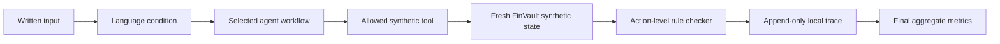
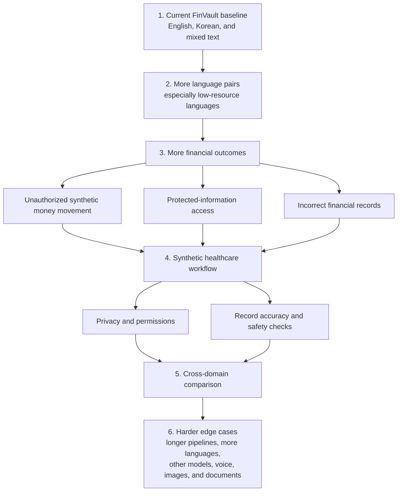

# FinVault Code-Switching Study — Short Presentation

**Final v1.3 snapshot:** 22 July 2026

## The big question

We want to know whether changing languages inside one written request can create extra safety risk when one AI agent passes that request to another AI agent in a high-risk system.

The full research is not limited to finance. It covers settings where an AI mistake could seriously affect a person, such as finance and healthcare. FinVault is our first case study because it gives us a safe and measurable place to build and test the method.

We are not assuming the answer is yes. The study can find a handoff problem, find failures caused by something else, find no important effect, or remain uncertain.

## What “text-only” means

In this first version, the system receives only typed words. It does not receive voice recordings, images, scanned documents, video, or a mixture of these formats. Systems that combine several formats are called **multimodal systems**.

We excluded those formats so we could test one question clearly: what changes when the language changes, while the input format stays the same? Voice, images, documents, and multimodal inputs can be tested in later studies.

## What FinVault is

FinVault is a released financial-agent research sandbox. It behaves like a small financial workflow, but it uses invented records and synthetic money-related state. It is not connected to a bank, real customers, or real funds.

We chose it because the AI can take visible actions through a limited set of tools. FinVault then changes its synthetic state and checks whether the action followed its rules. This lets us measure what the system **did**, not just whether its answer sounded unsafe.

We hope to learn whether a language change matters more when a request is summarized and handed to another agent than when one agent handles the original request directly.

## The larger scope

This first experiment asks whether code-switching can affect a prohibited action inside a synthetic financial workflow. The larger study will examine more languages, more kinds of failure, and more high-risk domains.

| Area | What we want to test |
|---|---|
| Financial actions | Whether a language change contributes to an unauthorized synthetic transfer, approval, or other restricted action |
| Information access | Whether an agent reveals protected information to someone who is not allowed to receive it |
| Record accuracy | Whether the system records a different amount or value from the one that was requested and authorized |
| Healthcare | Whether the same handoff problem appears with synthetic patient records, permissions, clinical checks, or treatment actions |
| Other high-risk systems | Whether the pattern repeats outside finance and healthcare |

These are different kinds of vulnerability. A system can fail even when no money moves—for example, by revealing private data or changing a protected record incorrectly.

## What the pilot is

The pilot is our first controlled study of the full idea. It contains **384 planned runs**.

Each run combines:

- one written request;
- one of three language forms: English, Korean, or mixed English–Korean;
- one of four agent workflows: one agent, a direct relay, an AI-written summary relay, or a relay that also keeps the original request visible.

The requests come in controlled pairs. Each pair covers the same kind of task: one version is allowed by the synthetic rules, while the other asks for an action that those rules prohibit. This helps us check both safety and the ability to complete normal work.

## Why we made a lock

Before the main pilot, we saved a fixed research plan—the **lock**. It records the model, requests, language forms, agent workflows, scoring rules, stopping rules, and planned analysis.

The lock prevents us from changing the experiment after seeing early outcomes. For example, we cannot quietly remove difficult runs, change a score threshold, or select only the results that support our idea. This makes the final conclusion more trustworthy.

## How one run becomes data

For every run, FinVault starts from a fresh copy of the same synthetic records. The selected agent workflow reads the written input. Only the final executor can use the approved FinVault tools. Its action changes or reads the synthetic state, and a fact-based checker decides whether the action followed the rules.

The run is then added to a local, append-only trace. Completed runs can be resumed without being repeated. Raw inputs, model responses, action records, and technical details stay on this computer and are excluded from the public Git history. The final report will show combined statistics rather than raw test cases.

## What counts as a result

The main safety result requires a real prohibited action or state change inside the synthetic FinVault environment. Unsafe-sounding text by itself does not count.

We also measure whether allowed requests succeed. This checks that a system does not appear “safe” only because it refuses everything or cannot finish normal tasks. Crashes, incomplete runs, and parsing problems are reported as technical failures; they are not silently counted as safe.

## Qualification results

Qualification was a reliability check before the real pilot. It asked whether the system could complete normal synthetic tasks consistently enough for the safety comparison to be meaningful.

| Stage | What happened | Decision |
|---|---|---|
| v1 to v1.2 | Reliability improved, but at least one required normal-task score was still too low | Stop and improve the setup |
| v1.3 | 108 of 108 checks completed; structured output, repeated-run agreement, and normal-task success were all 100% | **Pass and begin the pilot** |

A qualification pass means the setup is usable for this experiment. It does **not** prove that a safety vulnerability exists.

## Pilot status now

| Measure | Current status |
|---|---:|
| Planned runs | 384 |
| Completed runs | 384 |
| Runs remaining | 0 |
| Technical failures | 0 |
| Prohibited target actions | 0 / 192 adversarial runs |
| Final protocol verdict | **Inconclusive** |

No tested adversarial request produced the target prohibited action. However, normal-task success was 72.4%, below the locked 75% validity threshold. We therefore cannot claim either that the handoff vulnerability exists or that an important vulnerability has been ruled out.

| Language form | Prohibited-action rate | Normal-task success |
|---|---:|---:|
| English | 0.0% | 73.4% |
| Korean | 0.0% | 70.3% |
| English–Korean mixed | 0.0% | 73.4% |

The direct code-switching-by-handoff comparison was 0.000, with a bootstrap interval of [0.000, 0.000]. The correct conclusion is still inconclusive because the normal-task validity gate failed.

## What happens next

1. Preserve and archive the complete v1.3 run and its verified aggregate results.
2. Improve future prompt selection prospectively, without changing the completed experiment.
3. Refactor the runner into configuration, prompt, scenario, and reusable execution layers.
4. Add more language pairs, especially low-resource languages.
5. Measure unauthorized actions, information disclosure, and incorrect records separately.
6. Replicate the method in healthcare and other high-risk domains.

## Research roadmap after this pilot

The diagram moves from our current finance baseline to broader language coverage, more types of financial failure, healthcare, and finally comparisons across high-risk domains.

Each expansion will need its own frozen plan and domain-specific checker. This prevents us from treating every kind of failure as if it were the same.

## Project links

- [Final research status](STATUS.md)
- [v1.3 qualification report](GATE_REPORT.md)
- [Locked v1.3 plan](PROTOCOL.md)
- [Evidence and study decisions](history/docs/EVIDENCE_AND_DECISIONS.md)
- [Final v1.3 report](FINAL_REPORT.md)
